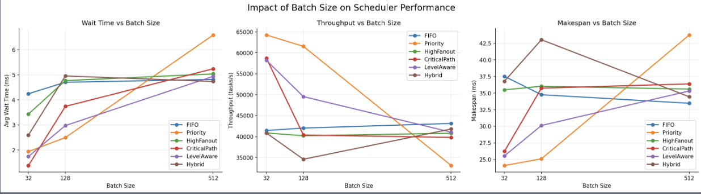

**Title: GPU Scheduling and Levelization for Circuit Task Graph Execution**

# Abstract
GPU-based logic simulation exposes a large number of fine-grained operations with strict data dependencies. Although gates within the same dependency frontier can be evaluated in parallel, each individual logic operation is extremely lightweight, so host-side scheduling overhead and CUDA kernel launch overhead can dominate total runtime. This project studies the tradeoff between scheduling flexibility and execution granularity for circuit task graphs. We parse benchmark circuits into directed acyclic graphs, implement several gate-level scheduling policies, and compare batch blocking, batch non-blocking, levelization, and fused levelization. The evaluation runs each circuit independently and reports makespan, throughput, average wait time, average execution time, average turnaround time, and runtime-level GPU utilization. Our results show that ready-queue ordering alone often has limited impact for very small gate operations, while reducing repeated small kernel launches through levelized and fused-level execution can provide a more direct performance benefit.

[Figure 1: Overall system pipeline. Show ckt parser -> gate task graph / level task graph -> scheduler -> CUDA executor -> metrics and reports.]

# 1.Introduction
Logic simulation is a central step in digital circuit verification. A circuit can naturally be represented as a directed acyclic graph, where each node is a logic gate and each edge represents a signal dependency. A gate can only execute after all of its predecessor gates have completed. GPUs provide massive parallelism, and gates at the same dependency level can potentially be evaluated in parallel. However, the computation performed by a single gate is very small. Basic logic operations such as AND, OR, XOR, and inversion require only a few instructions. As a result, launching too many small GPU kernels can make kernel launch overhead and synchronization overhead larger than the actual computation.

This project studies how scheduling policy and execution granularity affect GPU logic simulation. We compare two major directions. The first direction is gate-level scheduling, where each gate is a schedulable task and a scheduler selects ready gates from a ready queue. The second direction is levelized execution, where the circuit is first organized by topological levels and all gates in one level are executed as a coarser task. We further implement fused levelization, which merges consecutive small levels into a single GPU kernel to reduce repeated launch overhead in narrow tail levels.

The main contributions are as follows. First, we implement and compare several gate-level scheduling policies, including FIFO, fanin priority, SJF, and dependency-aware scheduling. Second, we evaluate different execution modes, including batch blocking and batch non-blocking. Third, we implement levelization and fused levelization with several fusion thresholds. Finally, we use host-side timing and GPU busy-interval accounting to analyze performance across benchmark circuits.

# 2.Background and Motivation
The topology of a circuit DAG determines which gates can be executed in parallel. A gate becomes ready when all of its predecessors have completed. Gate-level scheduling policies decide which ready gate should be executed first. For example, FIFO preserves ready-queue order, fanin priority favors gates with more inputs, SJF favors gates with smaller estimated work, and dependency-aware scheduling favors gates with more immediate downstream dependents. These policies can affect dependency progress and waiting time, but they still use each gate as the basic scheduling unit.

Levelization changes the execution structure. Each gate is assigned a topological level. Primary inputs or source nodes are placed in early levels, and each later gate is assigned based on the maximum level of its predecessors. Gates in the same level have no dependencies on each other, so they can be executed in parallel. Levelization reduces the number of scheduling units by packing many gates into a single level task.

However, many circuits contain a long narrow tail: later levels may contain only a few gates. If one GPU kernel is launched for every narrow level, launch overhead can still dominate runtime. Fused levelization addresses this problem by merging consecutive small levels. If each level in a consecutive segment has no more than a selected threshold, such as 256, 1024, or 2048 gates, the segment can be executed inside one GPU kernel. The kernel processes levels in order and uses lightweight intra-kernel synchronization between levels. This avoids repeated host-side launches while preserving the dependency order between levels.

[Figure 2: Levelization example. Show a small circuit DAG, organize gates by level, and highlight several consecutive narrow levels fused into one kernel.]

# 3.Methodology
## 3.1.Circuit Parsing and Task Graph Construction
We parse benchmark `.ckt` files to obtain gate counts, wire connections, gate types, and fan-in information. The circuit is stored as adjacency and inverse-adjacency lists. For gate-level scheduling, each gate is converted into a `Task` object. A task stores its gate id, priority, dependency list, remaining dependency count, and timing fields. A task becomes ready when its remaining dependency count reaches zero.

For levelization, the same circuit DAG is transformed into a level-task graph. We first assign each gate a topological level. Source gates are placed at level 0, and every other gate is assigned to one plus the maximum level among its predecessors. Then, all gates with the same level are packed into one level task. A level task stores the list of gate ids belonging to that level, and level tasks are connected sequentially so that level `k + 1` becomes ready only after level `k` has completed. This representation changes the scheduling unit from an individual gate to an entire topological level.

## 3.2. GPU Execution Backend
The GPU executor uses a unified gate-batch kernel. After a scheduler selects a batch of gates, the host copies their gate ids to the GPU and launches one CUDA kernel. Inside the kernel, each CUDA thread maps to one gate id in the selected batch. The thread reads the gate type and fan-in metadata, gathers predecessor outputs from the flattened input list, and computes the gate output. To make gate cost observable in our benchmark, we assign synthetic work units proportional to fan-in and repeat the gate computation accordingly.

Before each scheduler run, the executor resets gate outputs. Around each kernel launch, the host records launch and completion timestamps. These timestamps are used to compute host-side makespan and GPU busy intervals. GPU utilization is defined as the union of host-side active kernel intervals divided by makespan. This is a runtime-level utilization metric, not a profiler-level SM occupancy measurement.

## 3.3. Gate-Level Scheduling Policies
We compare four gate-level scheduling policies. FIFO executes ready gates in submission order and serves as the simplest baseline. Fanin priority favors gates with larger fan-in. SJF favors gates with smaller estimated work and is intended to reduce average waiting time. Dependency-aware scheduling precomputes the number of immediate downstream dependents for each gate and prioritizes gates that can potentially unlock more future work.

These policies are evaluated under two main gate-level execution modes. Batch blocking selects up to `batch_size` ready gates, launches one gate-batch kernel, waits for the batch to finish, and then updates dependencies. This creates a clear batch-level barrier: no successor gate is submitted until the whole launched batch completes. Batch non-blocking keeps several batches in flight across CUDA streams. As long as a stream is free, the scheduler can launch another ready batch. When any in-flight batch finishes, the host updates the dependencies of gates in that batch and immediately submits newly ready gates back to the scheduler. This mode reduces idle gaps and improves dependency responsiveness, while still using batch kernels instead of launching every gate individually.

## 3.4. Levelization and Fused Levelization
Levelization converts the gate-level DAG into a level-task graph. Each level task contains all gates in one topological level. The baseline levelization method launches one gate-batch kernel per level task and waits at level-wave barriers before unlocking later levels. Since gates in the same level are independent, this execution mode naturally exposes parallelism and reduces the number of scheduling units.

Fused levelization further merges consecutive small levels. Given a threshold `T`, if a ready level has no more than `T` gates, the scheduler continues checking the following levels from the same circuit. As long as each level is also under the threshold, the levels are placed into the same fused segment. The fused segment is processed by one CUDA kernel. The kernel iterates through levels in order, uses one thread block to process gates within each level, and uses `__syncthreads()` between levels. We evaluate `fused_level(256)`, `fused_level(1024)`, and `fused_level(2048)`.

[Figure 3: Execution mode comparison. Show three timelines: batch blocking launches ready-gate batches, levelization launches one kernel per level, and fused levelization launches one kernel for several small levels.]

# 4.Experimental Setup and Metrics
## 4.1.Benchmarks and Parameters
The evaluation uses ISCAS-style benchmark circuits. The small circuits include `c17`, `c432`, `c499`, and `c880`. The medium circuits include `c1355`, `c1908`, `c2670`, and `c3540`. The large circuits include `c5315`, `c6288`, and `c7552`. Each circuit is evaluated independently, so the reported results focus on single-circuit execution behavior.

Gate-level experiments use batch sizes of 32, 128, and 512. Levelized experiments are reported separately and compare levelization, `fused_level(256)`, `fused_level(1024)`, and `fused_level(2048)`. Each configuration is repeated several times, and reports include both averages and standard deviations.

## 4.2. Metrics
Average wait time measures how long a gate waits after becoming ready and before being launched. Maximum wait time is used as a starvation indicator. 

Average execution time is the host-side service interval attributed to each gate. In batch execution, all gates in a batch share the batch service time. In levelization, all gates in a level share the level service time. In fused levelization, the fused segment service time is divided across levels in proportion to each level's gate count, preventing the entire fused segment time from being assigned repeatedly to every level. 

Average turnaround time is wait time plus execution time.

Makespan is the total host-side runtime from the beginning of a scheduler run to the completion of the final GPU task. 

Throughput is the number of completed gates divided by makespan. 

GPU utilization is the union of host-side active GPU intervals divided by makespan.

# 5.Results and Analysis
## 5.1.Gate-Level Batch Scheduling
We first compare gate-level scheduling policies under batch blocking. Batch size has a strong impact on performance. A smaller batch size updates dependencies more frequently and can make successors ready earlier, but it increases the number of batches and kernel launches. A larger batch size reduces launch overhead and can improve makespan, but successors may wait until the entire current batch finishes.

The differences between scheduler policies are often smaller than the differences caused by batch size. This is consistent with the nature of GPU logic simulation: each gate operation is very lightweight, so ready-queue ordering alone may not compensate for excessive launch overhead. Dependency-aware scheduling can help in some circuits by unlocking more downstream gates earlier, but its benefit is limited when the ready set is already large or when launch overhead dominates.

## 5.2. Blocking and Non-Blocking Execution
Batch blocking is simple and launches one kernel per selected batch. However, it introduces a batch-level barrier: even if some gates conceptually finish earlier, dependents are not updated until the entire batch completes. Batch non-blocking removes part of this barrier by keeping several batches in flight. Once any batch completes, the scheduler updates its successors immediately and can launch newly ready work on an available stream.

When a circuit has deep dependency chains and small ready sets, non-blocking execution may reduce waiting time. However, if gate computation is extremely small, the additional stream management and more frequent dependency checks can outweigh the benefit of faster dependency updates. Therefore, non-blocking execution does not always reduce makespan, especially for small circuits or circuits with many narrow levels.

[figure: compare blocking vs non-blocking execution]

## 5.3. Levelization
Levelization changes the execution granularity. Instead of selecting ready gates to form batches, it executes the circuit by topological levels. This reduces the number of scheduling units and uses the natural parallelism within each level. In our experiments, levelization performs significantly better than the previous gate-level scheduling methods for circuit graph execution. The main reason is that each logic operation is extremely lightweight; even a small amount of host-side scheduling and launch overhead can noticeably affect total runtime. By packing gates into level tasks, levelization reduces the number of scheduling decisions and kernel launches.

The main weakness of levelization is narrow tail levels. Many circuits have wide early levels but many later levels containing only a few gates. Launching one kernel per narrow level provides little GPU work per launch, so host-side launch overhead can dominate. Therefore, the effectiveness of levelization depends on the level width distribution of the circuit.

[Figure 4: Gate-level scheduling execution versus levelization. Compare makespan and throughput between the best gate-level batch configuration and levelization.]

## 5.4. Fused Levelization
Fused levelization targets the narrow-tail problem directly. By executing consecutive small levels inside one kernel, it reduces repeated host-side launches and synchronization. We compare `fused_level(256)`, `fused_level(1024)`, and `fused_level(2048)`. A smaller threshold is conservative and preserves more of the original levelization structure, while a larger threshold reduces launches more aggressively but may place more sequential level work inside one kernel.

[Figure 5: Levelization versus fused levelization. Compare makespan and throughput for levelization, fused_level(256), fused_level(1024), and fused_level(2048).]

# 6.Weakness and Future Work
So far, this project has several limitations. First, GPU utilization is measured using host-side active intervals, not profiler-level SM occupancy. Second, the executor is a simplified course-project backend rather than a full industrial simulator. Third, the fused-level threshold is empirical and depends on GPU architecture, memory behavior, and circuit structure.

Based on our experiments, the most important observation is that levelization provides a large improvement for circuit graph execution. After reviewing related work, we believe that levelization and graph partitioning are more suitable directions for circuit graph execution than increasingly fine-grained GPU scheduling policies. Future work should therefore focus on improving levelized execution and exploring partition-based execution. For levelization, CUDA Graphs or conditional CUDA Graphs may reduce repeated launch overhead further. For partitioning, the circuit could be divided into subgraphs that balance parallelism, dependency depth, and GPU occupancy, possibly using replication-aided partitioning techniques.

# 7.Conclusion
This project compares several scheduling policies and execution granularities for GPU logic simulation. Gate-level scheduling policies affect waiting time and dependency progress, but their impact is limited by the very small cost of individual gate operations. Batch size has a strong effect because it changes both launch overhead and dependency update frequency. Levelization reduces scheduling granularity by executing gates level by level, and our experiments show that it can outperform fine-grained scheduling for circuit graph execution. However, narrow tail levels can still cause inefficient small kernel launches. Fused levelization reduces this overhead by executing consecutive small levels inside one kernel.

Overall, for fine-grained dependency-heavy GPU applications such as logic simulation, choosing the right execution granularity is often more important than designing a more complex ready-queue scheduler.
