**Title: GPU Scheduling and Levelization for Circuit Task Graph Execution**

# Abstract
基于 GPU 的 logic simulation 会产生大量 fine-grained operations，同时这些操作之间又存在严格的 data dependencies。虽然同一 dependency frontier 中的 gates 可以并行求值，但单个 logic operation 本身非常轻量，因此 host-side scheduling overhead 和 CUDA kernel launch overhead 可能主导总运行时间。本项目研究 circuit task graph 中 scheduling flexibility 与 execution granularity 之间的 tradeoff。我们将 benchmark circuits 解析为 directed acyclic graphs，实现多种 gate-level scheduling policies，并比较 batch blocking、batch non-blocking、levelization 和 fused levelization。实验对每个 circuit 独立运行，并报告 makespan、throughput、average wait time、average execution time、average turnaround time，以及 runtime-level GPU utilization。结果表明，对于极小的 gate operations，仅改变 ready queue 的排序通常影响有限；而通过 levelized 和 fused-level execution 减少重复的小 kernel launches，往往能带来更直接的 performance benefit。

# 1. Introduction
Logic simulation 是 digital circuit verification 中的核心步骤。一个 circuit 可以自然地表示为 directed acyclic graph (DAG)，其中每个 node 是一个 logic gate，每条 edge 表示一个 signal dependency。一个 gate 只有在所有 predecessor gates 都完成后才能执行。GPU 提供了大规模 parallelism，同一 dependency level 上的 gates 理论上可以并行求值。然而，单个 gate 执行的 computation 非常小。AND、OR、XOR 和 inversion 等 basic logic operations 通常只需要少量指令。因此，如果启动过多 small GPU kernels，kernel launch overhead 和 synchronization overhead 可能会超过真正的 computation。

本项目研究 scheduling policy 和 execution granularity 如何影响 GPU logic simulation。我们比较两个主要方向 (Figure 1)。第一个方向是 gate-level scheduling，即每个 gate 都是一个 schedulable task，scheduler 从 ready queue 中选择 ready gates。第二个方向是 levelized execution，即先按 topological levels 组织 circuit，然后将同一 level 中的所有 gates 作为一个更 coarse-grained task 执行。然而，许多 circuits 后续 levels 可能只有少量 gates，所以进一步实现 fused levelization，将连续的小 levels 合并到一个 GPU kernel 中，以减少 narrow tail levels 中的重复 launch overhead。

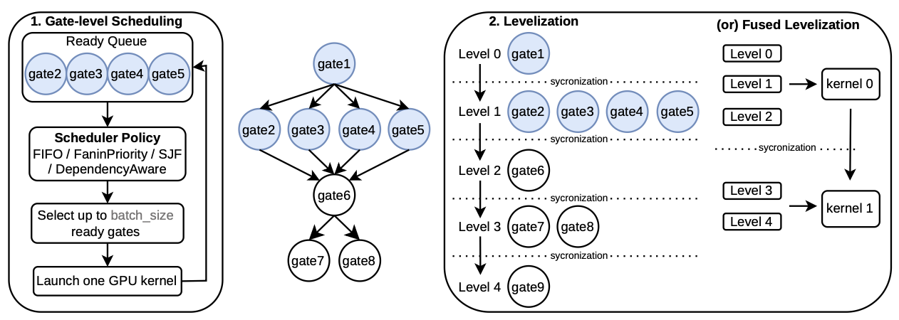
 
本文的 main contributions 如下。第一，我们实现并比较多种 gate-level scheduling policies (包括 FIFO、fanin priority、SJF 和 dependency-aware scheduling), 并且评估了不同 batch size 和 execution modes （包括 batch blocking 和 batch non-blocking）的影响。第二，我们实现 levelization 和三个 fusion thresholds 下的 fused levelization, 分析了多个 benchmark circuits 上的 performance。

# 2. Methodology
## 2.1. Circuit Parsing and Task Graph Construction
我们解析 benchmark `.ckt` 文件，得到 gate counts、wire connections、gate types 和 fan-in 信息。Circuit 以 adjacency list 和 inverse-adjacency list 形式存储。对于 gate-level scheduling，每个 gate 会被转换为一个 `Task` 对象。一个 task 存储其 gate id、priority、dependency list、remaining dependency count 和 timing fields。当 remaining dependency count 降为 0 时，该 task 变为 ready。

对于 levelization，同一个 circuit DAG 会被转换为 level-task graph。Source gates 被放在 level 0，其他每个 gate 的 level 为其所有 predecessors 最大 level 加 1。然后，所有相同 level 的 gates 被打包成一个 level task。一个 level task 存储属于该 level 的 gate id 列表，并且 level tasks 之间按顺序连接，使得 level `k + 1` 只有在 level `k` 完成后才会变为 ready。该 representation 将 scheduling unit 从 individual gate 改为 entire topological level。

## 2.2. GPU Execution Backend
GPU executor 使用统一的 gate-batch kernel。Scheduler 选出一批 gates 后，host 将这些 gate id 拷贝到 GPU，并启动一个 CUDA kernel。在 kernel 内，每个 CUDA thread 对应 selected batch 中的一个 gate id。线程读取 gate type 和 fan-in metadata，从 flattened input list 中收集 predecessor outputs，并计算该 gate output。为了让 gate cost 在 benchmark 中可观测，我们按照 fan-in 分配 synthetic work units，并相应重复 gate computation, 所以 fan-in,该gate运行时间越大。

每次 scheduler run 前，executor 会重置 gate outputs。在每次 kernel launch 前后，host 记录 launch 和 completion timestamps。这些 timestamps 用于计算 host-side makespan 和 GPU busy intervals。GPU utilization 定义为 host-side active kernel intervals 的并集除以 makespan。该指标是 runtime-level utilization，而不是 profiler-level SM occupancy。

## 2.3. Gate-Level Scheduling Policies
我们比较四种 gate-level scheduling policies。FIFO 按 submission order 执行 ready gates，是最简单的 baseline。Fanin priority 优先选择 fan-in 更大的 gates。SJF 优先选择 estimated work 更小的 gates，目标是减少 average wait time。在我们的实现中，estimated work 与 fan-in 成正比，因此 SJF 实际上会优先选择 fan-in 最小的 ready gate。Dependency-aware scheduling 会预先计算每个 gate 的 immediate downstream dependents 数量并优先选择可能 unlock more future work 的 gates，i.e., 优先选择 fan-out最大的gates。

这些 policies 在两种主要 gate-level execution modes 下进行评估。Batch blocking 每次最多选择 `batch_size` 个 ready gates，启动一个 gate-batch kernel，等待该 batch 完成，然后更新这批 batch 里所有完成 gates 的 dependencies，后续 gates 一旦 ready 即可加入 ready queue。

这会形成明确的 batch-level barrier：在整个 launched batch 完成之前，不会提交任何 successor gate。Batch non-blocking 则在多个 CUDA streams 上保持若干 batches in flight。只要某个 stream 空闲，scheduler 就可以启动另一个 ready batch。当任意 in-flight batch 完成时，host 会更新该 batch 中 gates 的 dependencies，并立即将 newly ready gates 提交回 scheduler。该模式减少 idle gaps 并提高 dependency responsiveness，同时仍然使用 batch kernels，而不是为每个 gate 单独启动 kernel。

## 2.4. Levelization and Fused Levelization

Levelization 将 gate-level DAG 转换为 level-task graph (Figure1(c))。每个 level task 包含同一 topological level 中的所有 gates。基础 levelization 方法为每个 level task 启动一个 gate-batch kernel，并在 level-wave barrier 处等待，然后解锁后续 levels。由于同一 level 中的 gates 互相独立，这种执行方式自然暴露 parallelism，并减少 scheduling unit 数量。

Fused levelization 进一步合并 consecutive small levels。给定 threshold `T`，如果一个 ready level 中的 gate count 不超过 `T`，scheduler 会继续检查同一 circuit 中的后续 levels。只要每一层也都低于 threshold，这些 levels 就会被放入同一个 fused segment。该 fused segment 由一个 CUDA kernel 处理。Kernel 按顺序遍历各 levels，使用一个 thread block 处理每层中的 gates，并在 levels 之间使用 `__syncthreads()` 来做lightweight intra-kernel synchronization。我们评估了 `T=256`、`T=1024` 和 `T=2048`。

# 3. Experimental Setup and Metrics
## 3.1. Benchmarks and Environment
实验使用 ISCAS-style benchmark circuits。Small circuits 包括 `c17`、`c432`、`c499` 和 `c880`。Medium circuits 包括 `c1355`、`c1908`、`c2670` 和 `c3540`。Large circuits 包括 `c5315`、`c6288` 和 `c7552`。每个 circuit 独立评估，因此报告结果关注 single-circuit execution behavior。

Gate-level experiments 使用 batch size 32、128 和 512。Fused Levelized experiments 使用 `fused_level(256)`、`fused_level(1024)` 和 `fused_level(2048)`。每种 configuration 在 T4 GPU 上重复运行多次，最终结果值取多次平均。

## 3.2. Metrics
Average wait time 衡量一个 gate 从变为 ready 到被 launched 之间等待了多久。Maximum wait time 用于指示潜在 starvation。

Average execution time 是归因到每个 gate 的 host-side service interval。在 batch execution 中，同一 batch 中所有 gates 共享该 batch 的 service time。在 levelization 中，同一 level 中所有 gates 共享该 level 的 service time。在 fused levelization 中，fused segment 的 service time 会按各 level 的 gate count 比例分摊到 level 上，避免将整个 fused segment time 重复分配给每个 level。

Average turnaround time 等于 wait time 加 execution time。

Makespan 是一次 scheduler run 从开始到最后一个 GPU task 完成的 host-side 总运行时间。

Throughput 是 completed gates 数量除以 makespan。

GPU utilization 是 host-side active GPU intervals 的并集除以 makespan。

# 4. Results and Analysis
## 4.1. Gate-Level Batch Scheduling
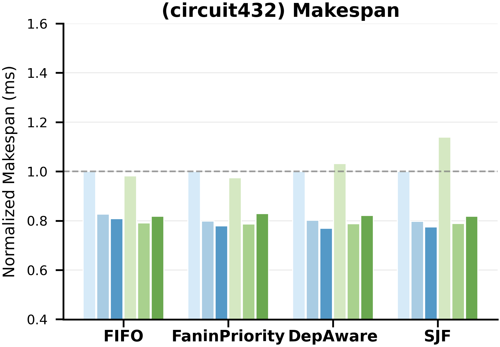 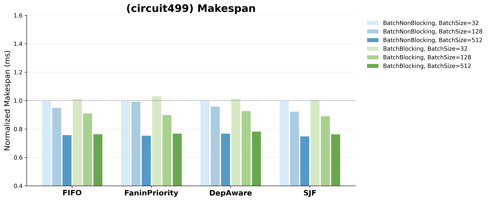 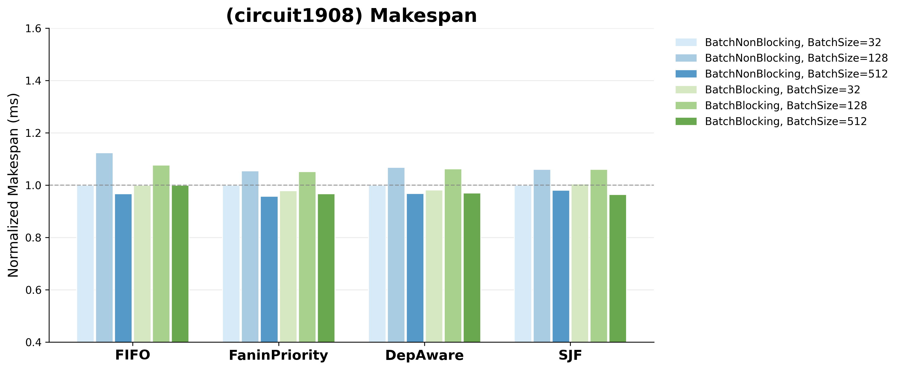 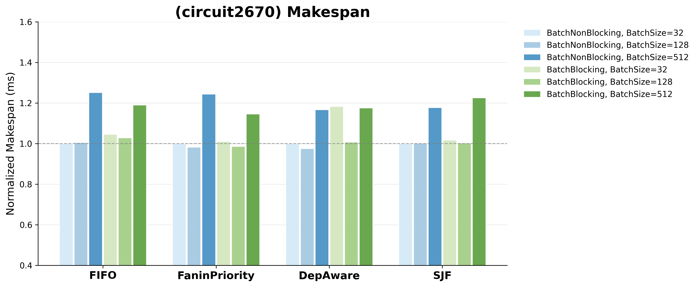 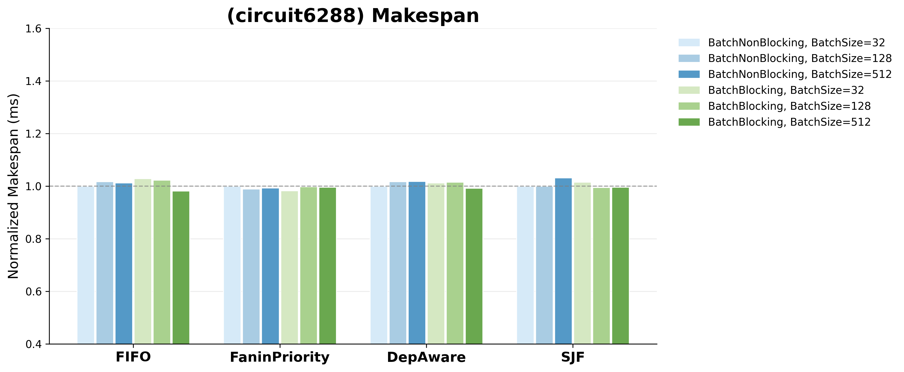 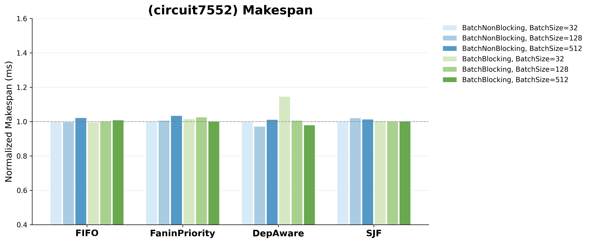 
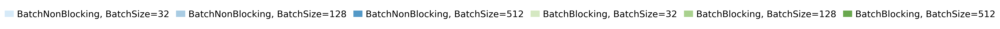

我们首先在 batch blocking 模式下比较不同 scheduling policies, 发现它们在同一 batch size 上的差异通常较小。这是因为每个 gate operation 都非常轻量，因此仅改变 ready queue 排序通常无法抵消 launch overhead 和更新 dependency 带来的 overhead (more explanation in 4.3)。Dependency-aware scheduling 在一些 circuits 中可以通过更早解锁 downstream gates 带来帮助，但当 ready set 已经较大，或 launch overhead 占主导时，其收益有限。

更大的 batch_size 并不总是带来性能提升。对小电路而言，增大 batch 可以减少 kernel launch 次数，因此有时会降低 makespan。例如在 c499 (Figure 2(a))中，FIFO non-blocking 的 batch_size 从 32 增加到 512 时，makespan 约下降 25%。这说明当电路规模较小、每个 gate 的计算量很低时，launch overhead 是主要瓶颈，较大的 batch 可以摊薄这部分开销。但这种趋势在大电路中并不稳定, 以 c2670 (Figure 2(b)) 为例，batch_size 从 128 增加到 512 后，各个 scheduling policies 的 makespan 反而上升。这里的原因分析为：(1) 在 blocking 模式下，host 必须等到每个 batch 完成后才能按 gate 为粒度更新 completed gates 的 dependent counts，并判断哪些 successor gates 新变为 ready。在大电路中，依赖更新和 ready-queue 维护的规模更大，大 batch 带来的粗粒度推进和集中更新可能抵消甚至超过 launch overhead 的减少。(2) 电路的 ready frontier 受 DAG topology 限制，并不是任意时刻都有足够多的 ready gates 填满大 batch。

针对 batch blocking 的缺点，batch non-blocking 主要想解决的是 blocking 模式中“必须等当前 batch 完成后才能继续推进” 的问题。它允许多个 batch 在不同 CUDA streams 上同时执行，并在某个 batch 完成后尽快更新其 successors，理论上可以让 GPU 更少空闲，也让 ready work 更快被提交。但实验中 non-blocking 和 blocking 的差异仍然不大，这里的原因分析为：(1) 虽然 non-blocking 可以增加 stream-level overlap，但每个 gate 的计算非常轻量，kernel 执行时间本身很短，能够被 overlap 的 GPU work 很有限。(2) host 端仍然需要频繁轮询 batch completion、更新 dependencies、维护 ready queue，并提交新的 batch。如果这些 CPU-side overhead 和 DAG bookkeeping 已经占据较大比例，那么引入多个 streams 并不能显著降低 makespan，甚至可能增加额外管理开销。

因此，blocking 到 non-blocking 的改进幅度有限，说明单纯优化 batch dispatch 方式并不足以解决核心问题。真正的瓶颈更可能在于 execution granularity：gate-level scheduling 把每个 gate 都作为独立 task 管理，导致大量 scheduling overhead 和 host-side dependency maintenance。

## 4.2. Levelization
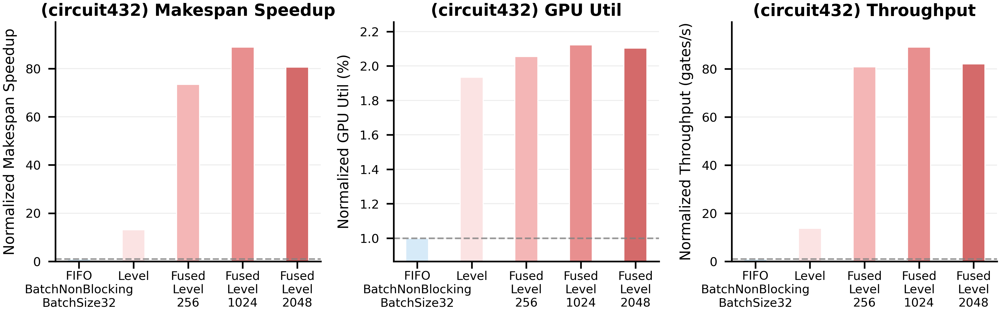 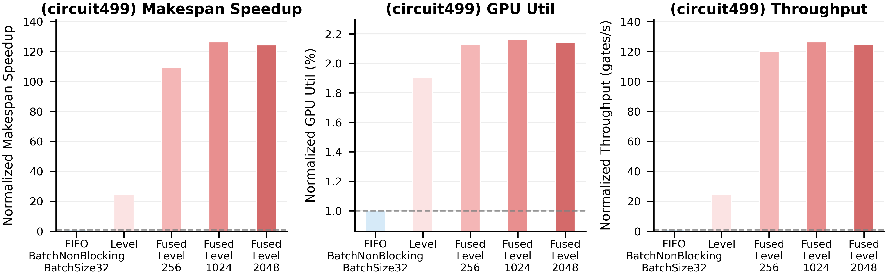 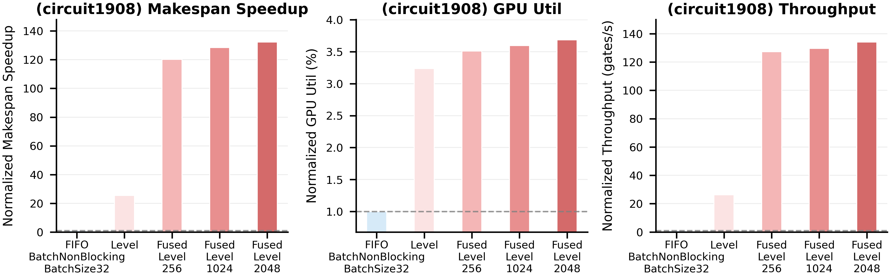 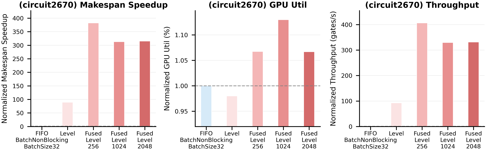 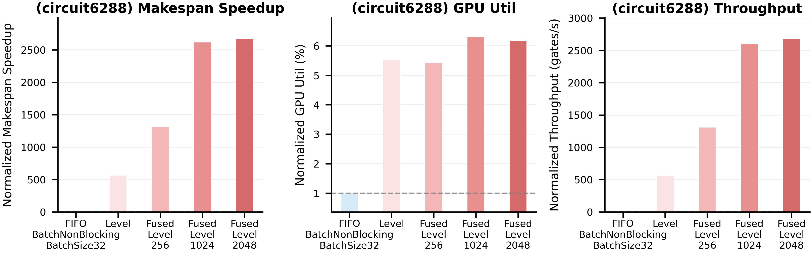 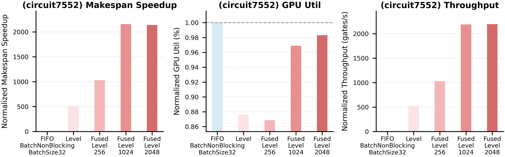 

Levelization 改变了 execution granularity。它不再选择 ready gates 组成 batch，而是按 topological level 执行 circuit。这减少了 scheduling unit 数量，并利用每层内部的 natural parallelism。在我们的实验中，levelization 在小中大circuits上的表现都显著优于之前的 gate-level scheduling 方法，以 FIFO BatchNonBlockingBatchSize=32 作为 baseline, levelization 的 makespan speedup 在小电路上达到约 15x, 在大电路上达到约 500x，随着电路越大，speedup越大。主要原因: (1) 每个 logic operation 都极其轻量, 即使少量 host-side scheduling 和 launch overhead，也会明显影响总运行时间。通过将 gates 打包为 level task，levelization 减少了 scheduling decisions 次数和 kernel launches 次数。(2) 正如在上述 gate-level scheduling 中提到的，一个 batch 完成后，runtime 需要为每个 completed gate (an individual task) 更新 dependencies，并且当前实现会在 gate granularity 上检查 dependency relationships。这些重复的 host-side bookkeeping 会被计入 makespan、wait time 和 turnaround time。相比之下，levelization 中一个 level 完成后只需解锁下一个 level task，而不是反复把每个 gate 作为独立 schedulable unit 来处理 dependency update，完全不用 host-side dependency maintenance。某些 gate-level batch 结果中较低的 GPU utilization 也支持这一解释：GPU 在大部分 wall-clock time 中处于空闲，而 host 花时间进行 scheduling 和 dependency bookkeeping。这也解释了为什么即使没有任何单独 level 宽于 512 个 gates，`batch_size = 512` 仍可能明显慢于 levelization。

Levelization 的主要弱点是 narrow tail levels。许多 circuits 早期 levels 较宽，但后期大量 levels 只包含少量 gates。为每个 narrow level 启动一个 kernel 时，每次 launch 提供的 GPU work 很少，因此 host-side launch overhead 可能主导 runtime。所以，levelization 的效果取决于 circuit 的 level width distribution。

## 5.4. Fused Levelization
Fused levelization 直接针对 narrow-tail problem。通过在一个 kernel 内执行 consecutive small levels，它减少了重复的 host-side launches 和 synchronization。我们比较合并层数为256，1024，2048的结果。在合并层数为 256时，就有了明显的提升。Beyond a certain fusion size, most small levels are already merged, further increasing the threshold doesn't help much.

# 6. Weakness and Future Work
目前，本项目仍有若干限制。第一，GPU utilization 使用 host-side active intervals 测量，而不是 profiler-level SM occupancy。第二，executor 是一个简化的 course-project backend，而不是完整的 industrial simulator。第三，fused-level threshold 是经验性的，取决于 GPU architecture、memory behavior 和 circuit structure。

基于实验结果，最重要的观察是 levelization 能显著改善 circuit graph execution。在回顾 related work 后，我们认为，与不断设计更 fine-grained GPU scheduling policies 相比，levelization 和 graph partitioning 更适合 circuit graph execution。未来工作应重点改进 levelized execution，并探索 partition-based execution。对于 levelization，可以借助 profiling tool (e.g. nvprof) 来进一步寻找最佳合并层数，CUDA Graphs 或 conditional CUDA Graphs 可能进一步减少重复 launch overhead。对于 partitioning，可以将 circuit 划分为若干 subgraphs，在 parallelism、dependency depth 和 GPU occupancy 之间取得平衡，也可以考虑 replication-aided partitioning 技术。

# 7. Conclusion
本项目比较了 GPU logic simulation 中的多种 scheduling policies 和 execution granularity。Gate-level scheduling policies 会影响 wait time 和 dependency progress，但其效果受限于单个 gate operation 的极低成本，巨大的 launch overhead 和 频繁dependency update带来的延时。Levelization 通过逐层执行 gates 降低 scheduling granularity，移除了大量 per-gate host-side scheduling 和 dependency-update overhead，而显著提高多个指标。然而，narrow tail levels 仍可能导致低效的小 kernel launches，则Fused levelization 通过在一个 kernel 内执行 consecutive small levels 来减少这一开销。总体而言，对于 logic simulation 这类 fine-grained、dependency-heavy GPU applications，选择合适的 execution granularity 通常比设计更复杂的 ready-queue scheduler 更重要。
